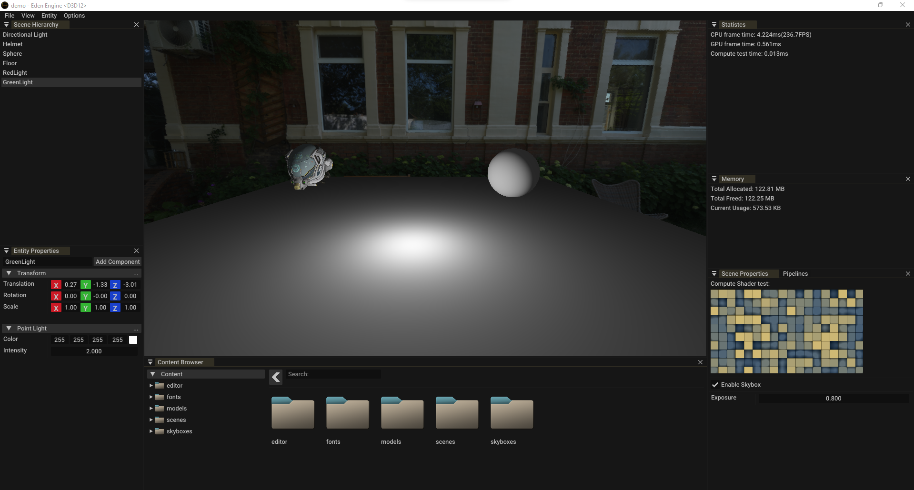
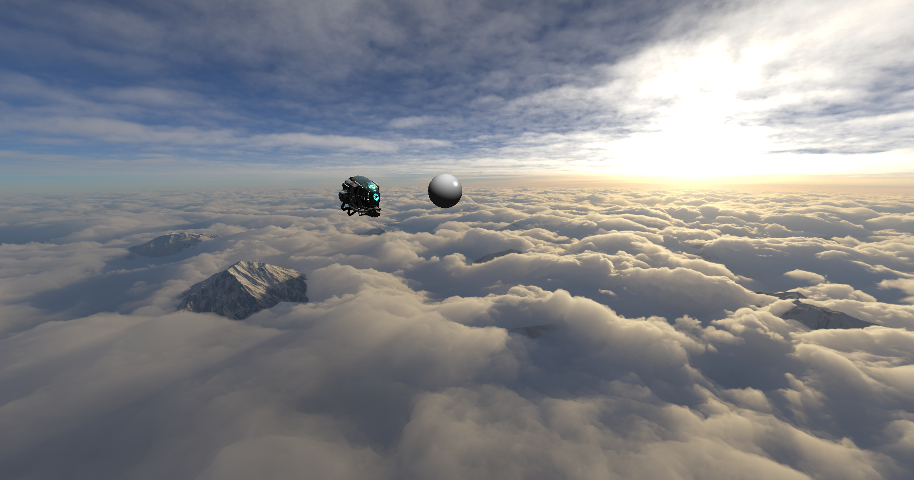
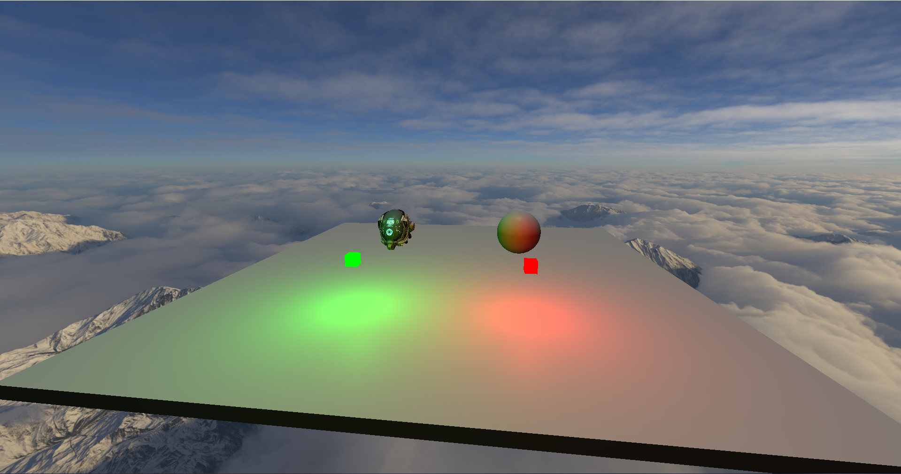
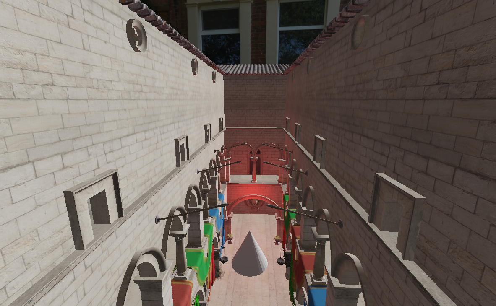
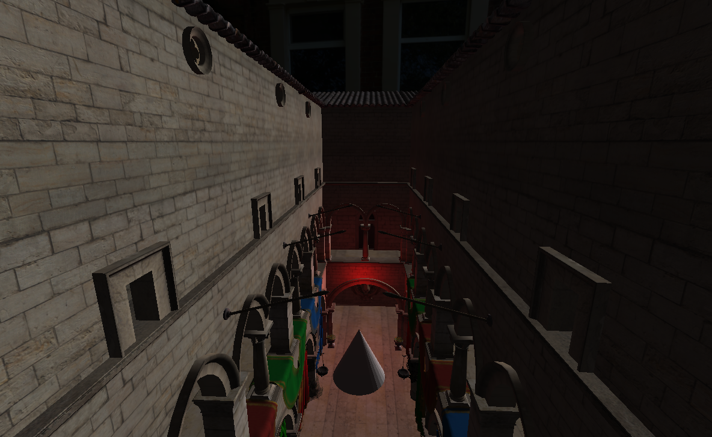
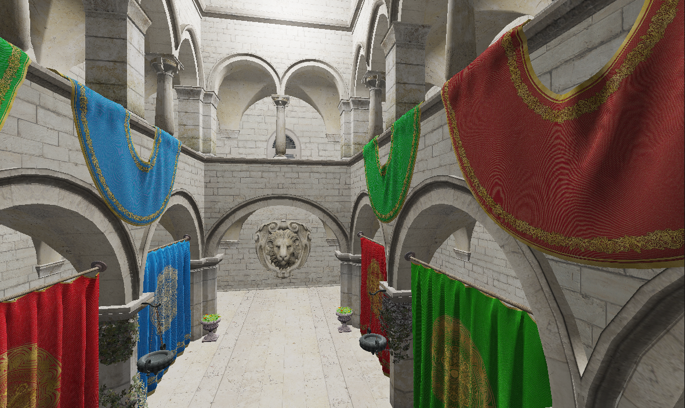
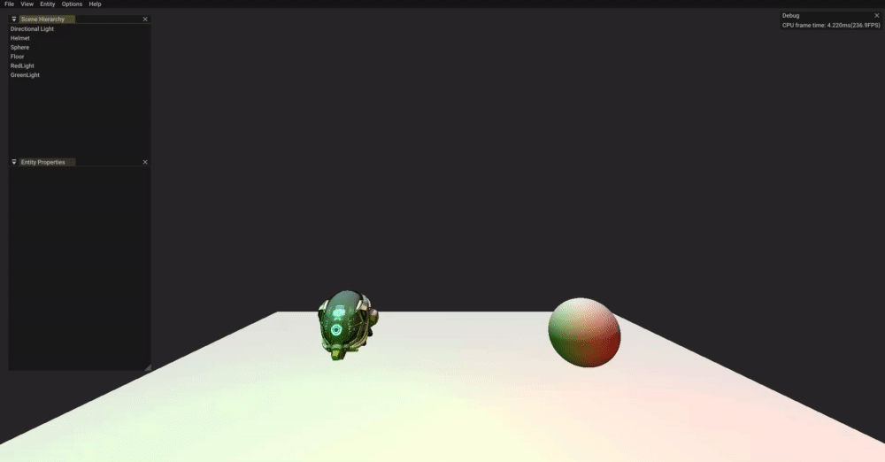
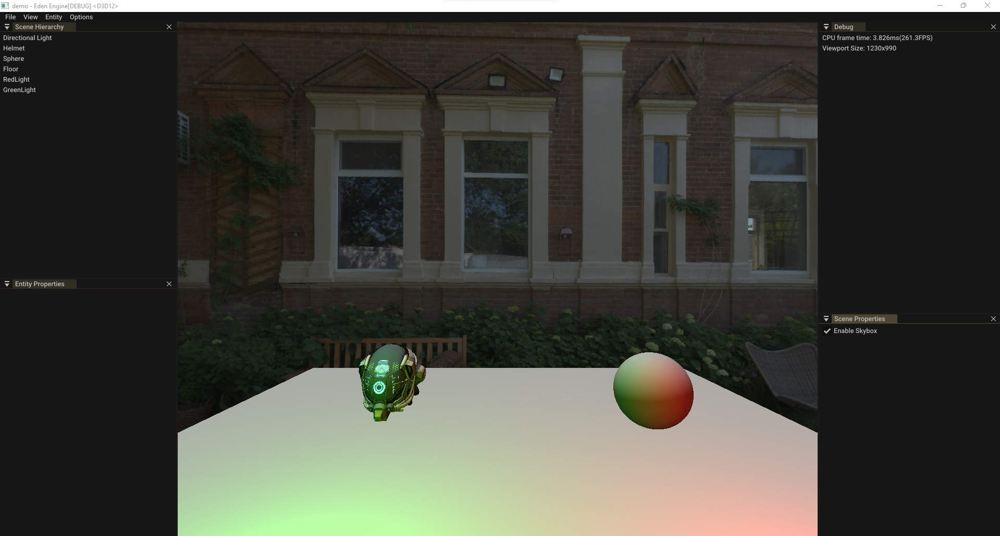
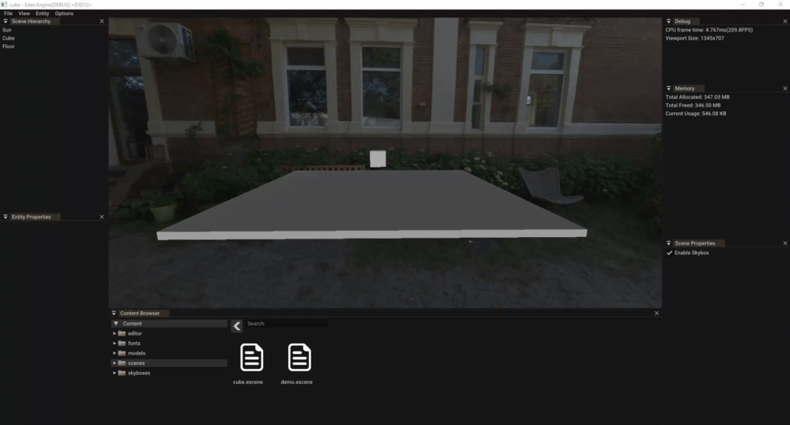

# **Requirements**
Windows 10 or newer
Windows 10 SDK 10.0.20348.0

# **Build**
### **Windows:**
Clone with `git clone --recursive https://github.com/danibma/EdenEngine.git`  
Run `GenerateProjects_vs2022.bat` to generate the Visual Studio 2022 solution, after that, open the solution and just build the project in one of the configurations
 

# **Configurations**
**Debug:** Symbols and asserts enabled, tracks memory, worst in performance  
**Profiling:** Symbols disabled, asserts enabled, tracks memory, best performance  
**Release:** Symbols and asserts disabled, doesn't track memory, best performance  

# **Features**
## **Graphics**
### Blinn-Phong Lighting

### Cubemaps through HDR file format

### Multiple Lights support

### HDR Pipeline with Gamma Correction
| On | Off |
|----|-----|
|  |  |

### Mip chain generation
| On | Off |
|----|-----|
|  |  |

## **Editor**
### Scene Serialization

### Editor UI working with ECS and using D3D12 Render Passes for Viewport

### Content browser with viewport interaction

